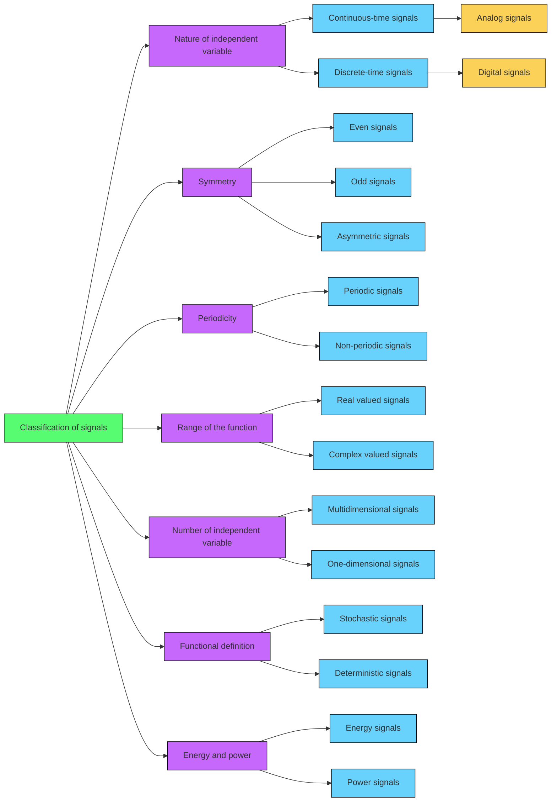

# Signals

A signal is a measurable (physical) function whose values describe a physical quantity. The **mathematical model** of a signal is a _function_ (mapping from a domain $\mathcal{D}$ to a range $\mathcal{R}$, i.e. $f(\cdot):\mathcal{D}\to\mathcal{R}$ ) or formula that describes the physical quantity of interest.

Generally the domain is the one-dimensional space of the positive reals (time $t\in\mathbb{R}^+$), although there are multidimensional signals (more than one independent variable).

## Classification of signals

The signals can be classified into several types, but the main ones are:

- #### Nature of independent variable:

  - ##### Continuous-time (CT) signals:
    are defined at every time instant in a time interval of interest, and its amplitude can assume any value in a continuous range.
  - ##### Discrete-Time (DT) Signals:
    are defined only at discrete time instants, and its amplitude can assume any value in a continuous range.
    - ###### Digital Signals:
      its amplitude can assume a value only from a finite given set.

- #### Symmetry:

  - ##### Even signals:
    are symmetric around the y-axis, i.e.:
    
    $$
    \begin{gather*}
        x_e(t) = x_e(-t) \\ 
        x_e[n]=x_e[-n]
    \end{gather*}
    $$

  - ##### Odd signals:
    are symmetric around the origin, i.e.:
    
    $$
    x_o(t) = x_o(-t) \\
    x_o[n]=x_o[-n]
    $$

  - ##### Asymmetric signals:
    are not symmetric if does not meet the above conditions. Any signal $x(t)$ or $x[n]$ can be represented as the sum of even and odd parts as:

- **Periodicity**:

  - **Periodic**: the signal is periodic, i.e. it repeats itself periodically.
    - $x(t)=x(nT)$ where $n$ is an integer and $T$ is the period of the signal.
    - $x[n]=x[n+N]$ where $N$ is the number of samples.
  - **Non-periodic**: if doesn't satisfy the periodicity condition, the signal is non-periodic.

  > **Note**: All CT sinusoidal signals are periodic, but not all DT sinusoidal signals are periodic. See [signals notebook](scripts/signals.ipynb).

### Transformations

There are 3 basic transformations of signals:

- **Shift**
- **Scale**
- **Reversal**
